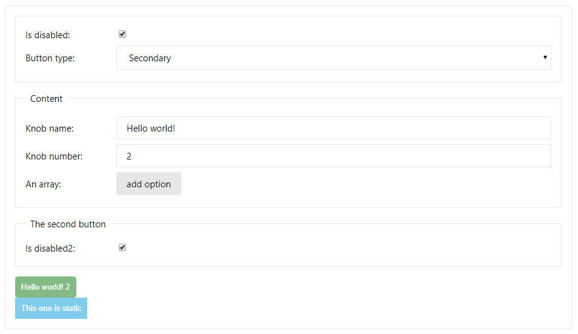

# styleguidist-knobs

A [react-styleguidist](https://github.com/styleguidist/react-styleguidist/) addon that adds a set of knobs to your examples, that users can interact with and change parameters of rendered components.



## Getting Started

To add `styleguidist-knobs` to your `react-styleguidist` configuration, follow these steps:

1. install the package using yarn or npm:

  ```bash
  yarn add --dev styleguidist-knobs
  ```

2. enhance the configuration in `styleguide.config.js`:

  ```diff
  module.exports = {
    components: 'src/components/**/[A-Z]*.js',
    defaultExample: true,
    webpackConfig: {
      module: {
        rules: [
          {
            test: /\.jsx?$/,
            exclude: /node_modules/,
            loader: 'babel-loader',
          },
          {
            test: /\.css$/,
            loader: 'style-loader!css-loader',
          },
        ],
      },
  -  }
  +  },
  +  require: [
  +    require('styleguidist-knobs')
  +  ]    
  };
  ```

3. add knobs to your examples!

## Adding knobs to your examples

The addon uses the render prop patterns to provide UI and functionality for your examples. This can be done by editing the Markdown files or via the live editor directly. Please note however that when using the live editor the example will keep reloading and might result in errors.

The first step is wrapping your code in the `KnobsUI` component (available globally in all your examples!):

```diff
- <Button>Hello world!</Button>
+ <KnobsUi>
+   {() => <Button>Hello world!</Button>}
+ </KnobsUI>
```

Check your examples to verify that it is rendered as previously.

Next, you'll want to add some actual knobs to your component:

```diff
-  {() => <Button>Hello world!</Button>}
+  {({ text }) => <Button>{text('Button label', 'Hello world!')}</Button>}
```

After this change, you should see a new knob UI with the "Button label" label, and an input field. Interacting with the field should change the example in real time!

## Available knobs

### text

Allows you to set a text value, used mainly for `PropTypes.string` props. Please note that the default value is required, as otherwise `undefined` will be passed, and you will get an error about changing an uncontrolled field to a controlled one.

```js
text(label, value)
```

### number

Similar to text, but produces a numeral value, using `<input type="number" />`. Use where a `PropTypes.number` is expected

```js
number(label, value)
```

### bool

Using this knob, a checkbox will be rendered. Use with `PropTypes.bool`. If no value is passed, `undefined` will be used.

```js
bool(label[, value])
```

### oneOf

Can be used whenever an `PropTypes.oneOf` is expected. 

```js
oneOf(label, value, options);
```

The `options` argument is required, and is expected to be an `Object` mapping the expected values to labels, example:

```js
const options = {
  small: 'Small variant',
  large: 'Large variant',
};
```

> In current version the keys will be casted to `string`, this is expected to change in future release. This knob API might also change.

### array

An array of `PropTypes.text` elements can be generated with this knob. It will present an UI that can be used to add and remove entries in the array.

```js
array(label, array)
```

## Authors and license

This library was created by [Bartosz Szczeciński](https://github.com/btmpl/).

MIT License, see the included LICENSE file.